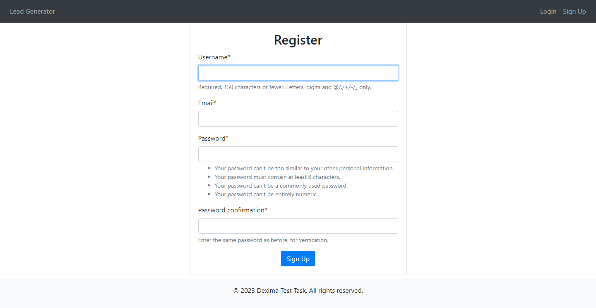
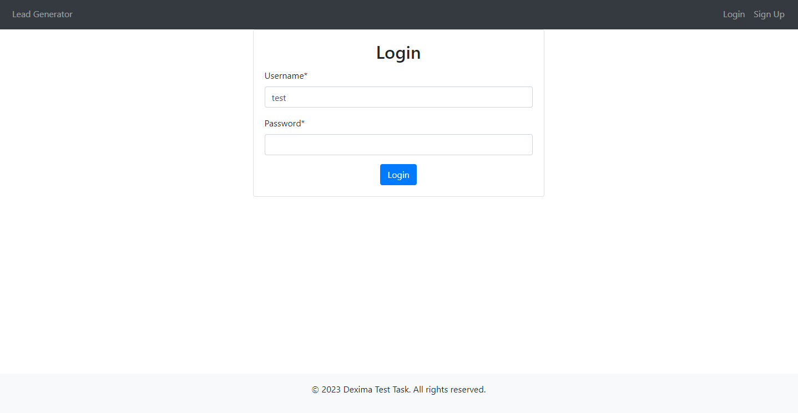
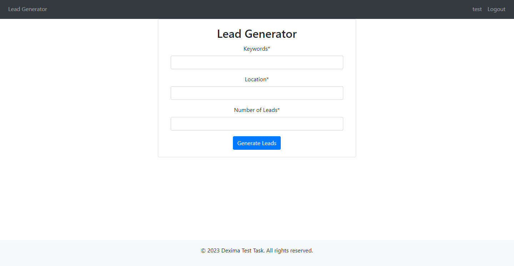

Sure! Here's an example README.md file for your Django project:

# Django Lead Generation Project

This is a Django project for lead generation. It allows users to generate leads by providing keywords, location, and the number of leads required. The project includes user registration and authentication functionality.

## Installation

1. Clone the repository:

```bash
git clone https://github.com/danylo-d/dexima_test_task.git
```

2. Navigate to the project directory:

```bash
cd dexima_test_task
```

3. Build and run the Docker containers:

```bash
docker-compose up --build
```

4. Access the application in your web browser:

```bash
http://localhost:8000
```

## Configuration

### Environment Variables

The following environment variables need to be set in the `.env` file:

- `POSTGRES_HOST`: PostgreSQL database host
- `POSTGRES_DB`: PostgreSQL database name
- `POSTGRES_USER`: PostgreSQL database user
- `POSTGRES_PASSWORD`: PostgreSQL database password
- `SECRET_KEY`: Django secret key

## Usage

1. Register a new user account by accessing the registration page:

```bash
http://localhost:8000/accounts/register/
```


2. Login using your registered account credentials.

3. Generate leads by accessing the lead generation page:
4. 
```bash
http://localhost:8000/lead_gen/lead_generator/
```


4. Fill in the form with keywords, location, and the number of leads required.

5. Submit the form to generate the leads.

## Dependencies

The project dependencies are listed in the `requirements.txt` file. They will be installed automatically when building the Docker containers.

## Contributing

If you'd like to contribute to this project, please follow these steps:

1. Fork the repository.

2. Create a new branch for your feature or bug fix:

```bash
git checkout -b <branch_name>
```

3. Make your changes and commit them:

```bash
git commit -m "Your commit message"
```

4. Push your changes to your forked repository:

```bash
git push origin <branch_name>
```

5. Create a pull request on the original repository.
